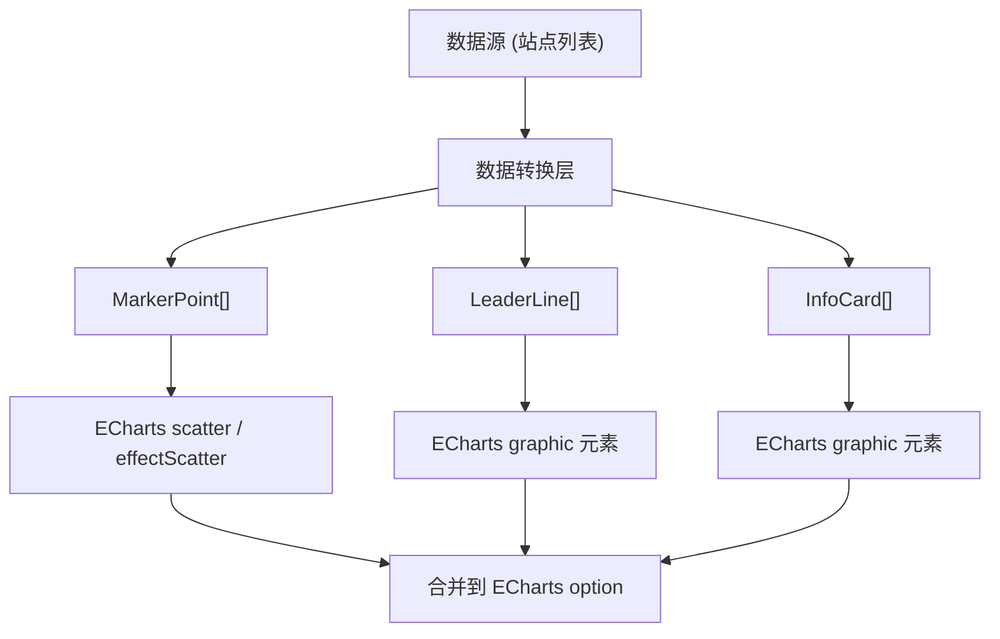

# ECharts 地图标记方案：点 + 引导线 + 卡片

## 原组件分析（BaiduMapVerticalMarker.vue）

原组件在百度地图上实现了三个视觉元素：

- **点（Marker）**：圆形标记点，放置在经纬度坐标上，支持状态配色（InUse/Constructing/Planning）、大小缩放、涟漪动画
- **引导线（Line）**：SVG 虚线，从点延伸到卡片，支持 L 型折线和直线，方向由 offset 配置决定
- **卡片（Card/Label）**：信息面板，显示名称 + 多个指标数据，支持详情模式和精简模式

原组件通过 `BMapGL.CustomOverlay` 将 Vue DOM 挂载到地图上，所有视觉都是 HTML/CSS/SVG。ECharts 是 Canvas 渲染，不能直接挂 DOM，需要用 ECharts 自身的系列和组件来实现。

## 整体架构



## 方案一：全 ECharts 原生（推荐）

用 ECharts `graphic` 组件在 canvas 上画引导线和卡片，用 `scatter` 画点。所有元素跟随地图缩放平移自动联动。

### 1. 数据模型定义

```typescript
// 点对象
interface MarkerPoint {
  id: string;
  name: string;
  coord: [number, number]; // [lng, lat]
  status: 'InUse' | 'Constructing' | 'Planning';
  color: string;           // 点颜色，可由 status 推导
  size: number;            // 点大小（默认 8）
  ripple: boolean;         // 是否有涟漪动画（用 effectScatter）
}

// 引导线对象
interface LeaderLine {
  id: string;
  pointId: string;         // 关联的 MarkerPoint.id
  offset: {                // 卡片相对于点的像素偏移
    x: number;             // 正数=右, 负数=左
    y: number;             // 正数=下, 负数=上
  };
  style: 'straight' | 'elbow'; // 直线 或 L型折线
  color: string;
  dashArray: [number, number]; // 虚线样式，如 [4, 2]
}

// 卡片对象
interface InfoCard {
  id: string;
  pointId: string;         // 关联的 MarkerPoint.id
  name: string;            // 标题
  metrics: Array<{
    label: string;
    value: string | number;
    unit?: string;
    color?: string;        // 指标前的圆点颜色
  }>;
  mode: 'detail' | 'minimal';
  offset: { x: number; y: number }; // 与 LeaderLine 一致
}
```

### 2. 点的实现 —— scatter + effectScatter

```javascript
// 普通点：scatter 系列
const scatterSeries = {
  type: 'scatter',
  coordinateSystem: 'geo', // 或 'bmap'
  data: points.filter(p => !p.ripple).map(p => ({
    name: p.name,
    value: [...p.coord, p],
  })),
  symbol: 'circle',
  symbolSize: (val) => val[2].size || 8,
  itemStyle: {
    color: (params) => params.value[2].color,
  },
  z: 10,
};

// 带涟漪动画的点：effectScatter 系列
const effectScatterSeries = {
  type: 'effectScatter',
  coordinateSystem: 'geo',
  data: points.filter(p => p.ripple).map(p => ({
    name: p.name,
    value: [...p.coord, p],
  })),
  symbol: 'circle',
  symbolSize: (val) => val[2].size || 8,
  rippleEffect: {
    brushType: 'stroke',
    scale: 2.5,
    period: 2,
  },
  itemStyle: {
    color: (params) => params.value[2].color,
  },
  z: 10,
};
```

### 3. 引导线 + 卡片的实现 —— graphic 组件

ECharts `graphic` 组件可以在 canvas 上绑定到地理坐标，并叠加像素偏移，非常适合画引导线和卡片。

```javascript
function buildGraphicElements(points, lines, cards, chart) {
  const elements = [];

  lines.forEach(line => {
    const point = points.find(p => p.id === line.pointId);
    if (!point) return;

    const { x: ox, y: oy } = line.offset;

    if (line.style === 'elbow') {
      // L型折线：先水平再垂直（或反之）
      const midX = ox / 2;
      elements.push({
        type: 'polyline',
        position: chart.convertToPixel('geo', point.coord),
        shape: {
          points: [[0, 0], [midX, 0], [midX, oy], [ox, oy]],
        },
        style: {
          stroke: line.color,
          lineWidth: 2,
          lineDash: line.dashArray,
        },
        z: 5,
        silent: true,
      });
    } else {
      // 直线
      elements.push({
        type: 'line',
        position: chart.convertToPixel('geo', point.coord),
        shape: { x1: 0, y1: 0, x2: ox, y2: oy },
        style: {
          stroke: line.color,
          lineWidth: 2,
          lineDash: line.dashArray,
        },
        z: 5,
        silent: true,
      });
    }
  });

  cards.forEach(card => {
    const point = points.find(p => p.id === card.pointId);
    if (!point) return;

    const [px, py] = chart.convertToPixel('geo', point.coord);
    const { x: ox, y: oy } = card.offset;

    elements.push({
      type: 'group',
      position: [px + ox, py + oy],
      z: 20,
      children: buildCardChildren(card), // 下面定义
    });
  });

  return elements;
}

function buildCardChildren(card) {
  if (card.mode === 'minimal') {
    // 精简模式：胶囊标签
    const text = `${card.name}  ${card.metrics[0]?.value ?? '--'}${card.metrics[0]?.unit ?? ''}`;
    return [
      {
        type: 'rect',
        shape: { x: 0, y: -14, width: text.length * 8 + 20, height: 28, r: 14 },
        style: { fill: 'rgba(0,113,255,0.8)', shadowBlur: 4, shadowColor: 'rgba(0,0,0,0.15)' },
      },
      {
        type: 'text',
        style: {
          text,
          x: 10,
          y: 0,
          fill: '#fff',
          font: 'bold 12px sans-serif',
          textVerticalAlign: 'middle',
        },
      },
    ];
  }

  // 详情模式：白色卡片
  const lineHeight = 20;
  const padding = 10;
  const headerHeight = 24;
  const cardHeight = headerHeight + card.metrics.length * lineHeight + padding * 2;
  const cardWidth = 180;

  const children = [
    {
      type: 'rect',
      shape: { x: 0, y: -cardHeight / 2, width: cardWidth, height: cardHeight, r: 4 },
      style: {
        fill: 'rgba(255,255,255,0.9)',
        shadowBlur: 6,
        shadowColor: 'rgba(0,0,0,0.15)',
        stroke: '#e0e0e0',
      },
    },
    // 标题胶囊
    {
      type: 'rect',
      shape: { x: padding, y: -cardHeight / 2 + padding, width: cardWidth - padding * 2, height: headerHeight, r: 12 },
      style: { fill: '#5e7ce0' },
    },
    {
      type: 'text',
      style: {
        text: card.name,
        x: cardWidth / 2,
        y: -cardHeight / 2 + padding + headerHeight / 2,
        fill: '#fff',
        font: 'bold 12px sans-serif',
        textAlign: 'center',
        textVerticalAlign: 'middle',
      },
    },
  ];

  // 指标行
  card.metrics.forEach((m, i) => {
    const rowY = -cardHeight / 2 + padding + headerHeight + 8 + i * lineHeight;
    if (m.color) {
      children.push({
        type: 'circle',
        shape: { cx: padding + 6, cy: rowY + 8, r: 4 },
        style: { fill: m.color },
      });
    }
    children.push({
      type: 'text',
      style: {
        text: m.label,
        x: padding + 16,
        y: rowY + 8,
        fill: '#252b3a',
        font: '12px sans-serif',
        textVerticalAlign: 'middle',
      },
    });
    children.push({
      type: 'text',
      style: {
        text: `${m.value ?? '--'}${m.unit ?? ''}`,
        x: cardWidth - padding,
        y: rowY + 8,
        fill: '#252b3a',
        font: 'bold 12px sans-serif',
        textAlign: 'right',
        textVerticalAlign: 'middle',
      },
    });
  });

  return children;
}
```

### 4. 地图缩放/平移时更新位置

graphic 元素的 position 是像素坐标，地图交互后需要重新计算：

```javascript
chart.on('georoam', () => {
  const newElements = buildGraphicElements(points, lines, cards, chart);
  chart.setOption({ graphic: newElements });
});
```

### 5. 颜色配置（与原组件一致）

```javascript
const STATUS_COLOR_MAP = {
  InUse:         '#50d4ab',
  Constructing:  '#e6b71f',
  Planning:      '#a1a6b2',
};

const LINE_COLOR_MAP = {
  InUse:         '#50d4ab',
  Constructing:  '#e6b71f',
  Planning:      '#a1a6b2',
  default:       '#5e7ce0',
};
```

### 6. 交互事件

```javascript
// 点击散点
chart.on('click', 'series.scatter', (params) => {
  const pointData = params.value[2]; // MarkerPoint
  // 处理点击事件...
});

// 鼠标悬停卡片（graphic 元素）
// 在 buildCardChildren 中给 group 添加:
{
  type: 'group',
  // ...
  onmouseover: () => { /* 提升 z, 放大 */ },
  onmouseout: () => { /* 还原 */ },
  onclick: () => { /* 回调 */ },
}
```

## 方案二：HTML 覆盖层（备选）

如果对卡片样式复杂度要求高（比如需要 Vue 组件、复杂交互），可在 ECharts 容器上叠加一层绝对定位的 HTML 层，用 `chart.convertToPixel('geo', coord)` 计算像素位置，再用 Vue 组件渲染卡片和线。这本质上与百度地图的 CustomOverlay 方式相同。

缺点是需要自己处理缩放/平移同步，性能不如方案一。

## 使用示例

```javascript
import { reactive } from 'vue';

// 1. 定义数据
const siteList = reactive([
  {
    id: 'site-1',
    name: '上海嘉定数据中心',
    coord: [121.26, 31.38],
    status: 'InUse',
    metrics: [
      { label: '机架数', value: 1200, unit: '架' },
      { label: '功率', value: 8.5, unit: 'MW' },
    ],
    offset: { x: 40, y: -30 },
    lineStyle: 'elbow',
    cardMode: 'detail',
  },
  // ...更多站点
]);

// 2. 转换为 ECharts 所需的 points / lines / cards
const points = siteList.map(s => ({
  id: s.id,
  name: s.name,
  coord: s.coord,
  status: s.status,
  color: STATUS_COLOR_MAP[s.status],
  size: 10,
  ripple: s.status === 'InUse',
}));

const lines = siteList.map(s => ({
  id: `line-${s.id}`,
  pointId: s.id,
  offset: s.offset,
  style: s.lineStyle || 'elbow',
  color: LINE_COLOR_MAP[s.status] || LINE_COLOR_MAP.default,
  dashArray: [4, 2],
}));

const cards = siteList.map(s => ({
  id: `card-${s.id}`,
  pointId: s.id,
  name: s.name,
  metrics: s.metrics,
  mode: s.cardMode || 'detail',
  offset: s.offset,
}));

// 3. 组装 ECharts option
const option = {
  geo: { map: 'china', roam: true },
  series: [scatterSeries, effectScatterSeries],
  graphic: buildGraphicElements(points, lines, cards, chart),
};
chart.setOption(option);
```

## 关键差异对照

| 元素 | 原组件（百度地图） | ECharts 方案 |
|------|-------------------|-------------|
| 点 | CSS 圆形 + 伪元素涟漪 | `effectScatter` 的 `rippleEffect` |
| 引导线 | SVG `<line>` | `graphic.polyline` 或 `graphic.line` |
| 卡片 | HTML/CSS DOM | `graphic.group`（含 rect + text + circle） |
| 位置更新 | 百度地图 SDK 自动管理 | 监听 `georoam` 事件手动更新 `graphic` 位置 |
| 偏移配置 | `AMapGlobalLayoutLocationConfig.js` 按站点名称配置 | 直接在数据对象的 `offset` 字段中配置 |
