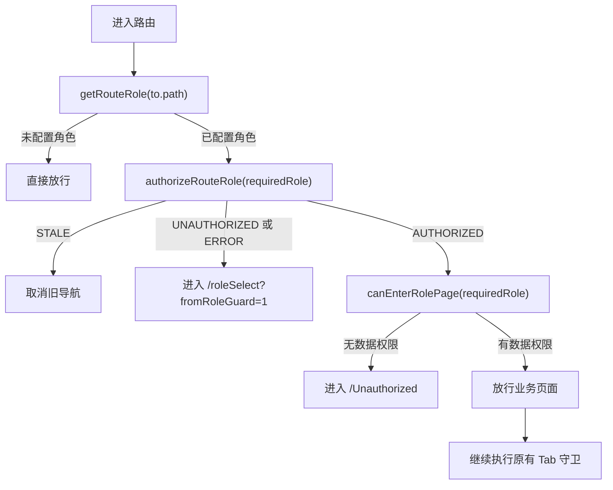

# 统一角色权限加载与角色路由使用指南

## 1. 设计目标

本项目通过一套共享机制统一处理以下问题：

- 根据访问路径确定目标角色。
- 进入角色业务页面前校验用户是否拥有该角色。
- 按当前角色携带 `X-Current-Role` 获取对应的数据权限。
- 统一管理角色目录、当前角色和不同角色的数据权限状态。
- 合并相同角色的并发请求，减少重复调用 `getPermissionConfig`。
- 快速切换角色时阻止旧响应覆盖新角色状态。
- 角色存在但没有数据权限时，引导用户进入数据权限申请页。

核心代码位于：

| 文件 | 职责 |
| --- | --- |
| `src/config/role.js` | 角色路由配置、共享权限状态、接口加载器、角色切换和权限判断 |
| `src/router/index.js` | 注册角色路由守卫，根据目标路径执行角色准入 |
| `src/views/RoleSelect.vue` | 初始化角色目录、选择角色、4A 登录回跳处理 |
| `src/components/RoleMenu.vue` | 顶部角色菜单和业务页角色切换 |
| `src/views/noPermission/noDataAuth.vue` | 数据权限申请及安全返回时的角色恢复 |
| `src/config/routes.js` | 原有路径与 Tab 参数匹配配置 |

## 2. 必须遵守的权限规则

页面权限和数据权限是两种不同的权限，不可以混用。

### 2.1 页面角色权限

用户是否拥有某个角色，只判断接口返回的 `ruleCodeList`：

```js
const ownsRole = data.ruleCodeList.some((role) => {
  return role.code === targetRole;
});
```

例如，只有 `ruleCodeList` 包含 `ROLE_CXO`，用户才拥有角色1的页面权限。

### 2.2 角色1数据权限

角色1是否拥有数据权限，只判断 `dataTypeCodeMap`：

```js
const hasCxoDataPermission =
  dataTypeCodeMap.CXO_CLOUD_GENERAL_COMPUTING.length > 0
  || dataTypeCodeMap.CXO_CLOUD_NPU.length > 0;
```

`ruleCodeList` 包含 `ROLE_CXO` 但两个数组都为空，表示：

- 用户拥有角色1。
- 用户没有角色1的数据权限。
- 不允许进入角色1业务页面。
- 应进入 `/Unauthorized` 申请数据权限。

### 2.3 角色2数据权限

角色2的数据权限由已拥有的云服务或 Region 判断：

```js
const hasFrontSalesDataPermission =
  cloudServerPermissionList.length > 0
  || regionPermissionList.length > 0;
```

## 3. 统一角色路由配置

角色与业务页面的映射只维护在 `src/config/role.js`：

```js
export const ROLE_ROUTE_CONFIG = {
  ROLE_CXO: {
    defaultPath: '/costOperation',
    paths: [
      '/costOperation',
      '/aiCompute',
      '/generalCompute',
    ],
  },
  ROLE_FRONT_SALES: {
    defaultPath: '/saleHome',
    paths: [
      '/saleHome',
      '/saleDetail',
    ],
  },
};
```

配置字段说明：

| 字段 | 说明 |
| --- | --- |
| 配置对象的 key | 后端返回的角色 code，同时也是 `X-Current-Role` 的值 |
| `defaultPath` | 用户选择该角色并点击“立即体验”后的默认业务入口 |
| `paths` | 属于该角色的全部受保护业务路由 |

项目通过以下函数读取配置：

```js
getRouteRole(path);
getRoleTargetPath(roleValue);
isRoleManagedRoute(path);
```

- `getRouteRole('/aiCompute')` 返回 `ROLE_CXO`。
- `getRoleTargetPath('ROLE_FRONT_SALES')` 返回 `/saleHome`。
- 未配置的页面返回 `undefined`，不会执行角色准入。

`/roleSelect`、`/Unauthorized`、`/noPermission` 等页面当前不属于角色业务路由，不会触发角色守卫。

## 4. 新增角色或业务页面

### 4.1 给已有角色增加页面

只需要把页面路径加入对应角色的 `paths`：

```js
ROLE_CXO: {
  defaultPath: '/costOperation',
  paths: [
    '/costOperation',
    '/aiCompute',
    '/generalCompute',
    '/newCxoPage',
  ],
},
```

同时仍需在 `src/router/index.js` 的 Vue Router 路由表中注册该页面组件。

### 4.2 增加新角色

先在统一配置中增加角色：

```js
ROLE_NEW: {
  defaultPath: '/newRoleHome',
  paths: [
    '/newRoleHome',
    '/newRoleDetail',
  ],
},
```

然后根据后端协议完成以下内容：

1. 在 `ROLE_CODE_ORDER` 中确定角色展示顺序。
2. 如角色暂不可用，在 `DISABLED_ROLE_CODES` 中配置。
3. 在 `ROLE_AVATAR_MAP` 中配置角色头像。
4. 在 `initializePermissionConfig(data, roleValue)` 中增加该角色的响应解析分支。
5. 在 `hasDataPermission(roleValue)` 中增加该角色的数据权限判断。
6. 在 Vue Router 路由表中注册业务页面。

不要把新角色默认归为销售角色，也不要为未配置角色增加隐式入口。

## 5. 权限接口请求规则

统一加载器最终调用：

```js
getPermissionConfig(config);
```

### 5.1 无角色头请求

用于取得角色目录和 `ruleCodeList`：

```js
getPermissionConfig();
```

请求中不存在 `X-Current-Role`。

### 5.2 指定角色请求

用于取得目标角色的数据权限：

```js
getPermissionConfig({
  headers: {
    'X-Current-Role': 'ROLE_CXO',
  },
});
```

请求配置由共享模块根据传入的 `roleValue` 创建。异步执行期间不会临时读取可能已经变化的 `selectedRoleValue`。

## 6. 不同角色的响应结构

后端会根据 `X-Current-Role` 返回不同字段，页面代码不能假设两种角色的专属字段同时存在。

### 6.1 `ROLE_CXO`

角色1只解析：

- `account`
- `totalDimenPermConfigList`
- `ruleCodeList`
- `dataTypeCodeMap`

其中：

- 维度 `1` 是角色列表。
- 维度 `3` 是全部数据类型。
- 维度 `6` 是角色1云服务。
- `dataTypeCodeMap` 是角色1已拥有的云服务与数据类型绑定关系。

```js
dataTypeCodeMap: {
  CXO_CLOUD_GENERAL_COMPUTING: [],
  CXO_CLOUD_NPU: [],
}
```

### 6.2 未传角色或 `ROLE_FRONT_SALES`

角色2分支解析：

- `account`
- `totalDimenPermConfigList`
- `ruleCodeList`
- `cloudServerNameList`
- `regionCodeList`
- `geoTree`

当前页面不消费的字段不应为了兼容而增加无用途状态。

### 6.3 初始化原则

`initializePermissionConfig(data, roleValue)` 必须接收本次请求实际使用的角色。

初始化时会：

1. 更新公共角色目录。
2. 清空上一角色的专属权限状态。
3. 根据 `roleValue` 只读取当前角色协议内的字段。
4. 更新当前角色的共享响应式权限状态。

不要使用当前界面上临时选中的角色代替本次请求角色，否则快速切换时可能解析错误的响应结构。

## 7. 共享加载器 API

共享加载器位于 `src/config/role.js`。

### 7.1 `ensureRoleCatalog()`

用途：普通角色选择页获取角色目录。

行为：

- 发送不带 `X-Current-Role` 的请求。
- 当前 SPA 已成功加载目录时直接复用。
- 返回 `true` 表示目录初始化成功。

```js
const catalogReady = await ensureRoleCatalog();
```

### 7.2 `refreshRoleCatalog()`

用途：`/roleSelect?fromRoleGuard=1` 场景强制重新取得登录后的角色目录。

行为：

- 不使用“目录已加载”结果。
- 请求一定不带 `X-Current-Role`。
- 如果已有相同的无头请求正在进行，会复用该 Promise。

```js
const catalogReady = await refreshRoleCatalog();
```

### 7.3 `ensureRolePermission(roleValue)`

用途：确保某个角色的权限已经加载。

行为：

- 已成功加载同一角色时直接复用。
- 同一角色正在请求时复用相同 Promise。
- 常用于 `RoleMenu` 或申请页读取当前角色权限。

```js
await ensureRolePermission('ROLE_CXO');
```

### 7.4 `authorizeRouteRole(roleValue)`

用途：路由守卫校验目标业务页面的角色。

行为：

- 根据路由确定的角色发送请求。
- 通过 `ruleCodeList` 判断用户是否拥有目标角色。
- 拥有角色时初始化数据权限并保存当前角色。
- 不拥有角色时不把目标角色保存为当前角色。

```js
const status = await authorizeRouteRole(requiredRole);
```

### 7.5 `changeSelectedRole(roleValue)`

用途：用户在角色选择页或顶部角色卡片主动切换角色。

行为：

- 加载新角色前清空上一角色的专属权限状态。
- 已加载同一角色时不重复请求。
- 成功后更新 `selectedRoleValue` 和 session 中的当前角色。

```js
const status = await changeSelectedRole(roleValue);
```

### 7.6 `restoreSelectedRole(roleValue)`

用途：从数据权限申请页返回原业务页面前恢复原角色。

行为：

- 强制重新请求原角色权限。
- 请求成功并确认拥有该角色后才恢复页面。

```js
const status = await restoreSelectedRole(returnRole);
```

### 7.7 权限状态

所有角色权限加载操作返回以下状态之一：

| 状态 | 含义 | 调用方处理 |
| --- | --- | --- |
| `AUTHORIZED` | `ruleCodeList` 包含目标角色且初始化成功 | 可以继续检查数据权限 |
| `UNAUTHORIZED` | `ruleCodeList` 不包含目标角色 | 进入角色选择页 |
| `STALE` | 请求已被更新的角色操作替代 | 忽略旧结果，不执行跳转 |
| `ERROR` | HTTP 异常或响应数据无效 | 阻止进入受保护页面 |

推荐使用：

```js
if (!isRolePermissionAuthorized(status)) {
  return;
}
```

## 8. 请求合并和竞态控制

共享加载器按请求类型保存正在进行的 Promise：

- 无角色头请求使用独立 key。
- `ROLE_CXO` 请求使用角色 code 作为 key。
- `ROLE_FRONT_SALES` 请求使用角色 code 作为 key。

两个调用方同时请求相同角色时，只会产生一个后端请求。

不同角色快速切换时，加载器使用操作版本号判断响应是否过期。旧请求完成后返回 `STALE`，不能写入共享状态，也不能触发旧角色跳转。

缓存只存在于当前 SPA 生命周期：

- 浏览器刷新后重新校验。
- 不在本地保存数据权限。
- `sessionStorage` 只保存用户当前选择的角色，key 为 `infraMap:selectedRole`。

## 9. 路由守卫执行流程

角色守卫注册在原有 Tab 路由守卫之前：

```js
router.beforeEach(roleAccessGuard);
router.beforeEach(beforeEachGuard);
```

访问路由时的执行顺序：



路由决定目标角色，不能根据 session 中当前选择的角色推断目标角色。

例如：

- 访问 `/costOperation`，目标角色一定是 `ROLE_CXO`。
- 访问 `/saleDetail`，目标角色一定是 `ROLE_FRONT_SALES`。
- 即使 session 当前保存的是角色2，访问 `/aiCompute` 时仍校验角色1。

## 10. 4A 登录回跳流程

当角色守卫无法取得有效权限数据时，会进入：

```text
/roleSelect?fromRoleGuard=1
```

该页面固定按以下顺序初始化：

1. 调用 `refreshRoleCatalog()`，发送一次无角色头请求。
2. 从 `ruleCodeList` 确定当前角色：
   - session 中角色仍属于当前用户时，使用 session 角色。
   - 否则优先使用 `ROLE_CXO`。
   - 没有角色1且只有角色2时，使用 `ROLE_FRONT_SALES`。
3. 调用 `restoreSelectedRole(roleValue)`，发送一次携带角色头的请求。
4. 两次请求完成后展示角色卡片。
5. 不自动进入业务页面，由用户重新确认角色和操作。

角色1的请求顺序：

```text
getPermissionConfig()
getPermissionConfig({ headers: { 'X-Current-Role': 'ROLE_CXO' } })
```

仅角色2的请求顺序：

```text
getPermissionConfig()
getPermissionConfig({ headers: { 'X-Current-Role': 'ROLE_FRONT_SALES' } })
```

不要在该流程前调用 `ensureRoleCatalog()`，否则可能复用登录前无效的目录状态。

## 11. 角色选择页使用方式

用户点击角色时：

```js
const handleRoleSelection = (roleValue) => {
  pendingPermissionRequest = changeSelectedRole(roleValue);
};
```

用户点击“立即体验”时，必须先等待本次角色请求：

```js
const handleStart = async (roleValue) => {
  const status = await pendingPermissionRequest;

  if (!isRolePermissionAuthorized(status)) {
    return;
  }

  if (canEnterRolePage(roleValue)) {
    router.push(getRoleTargetPath(roleValue));
    return;
  }

  router.push('/Unauthorized');
};
```

不能在角色请求完成前直接进入业务页面，否则路由守卫可能读取到上一角色的权限状态。

普通 `/roleSelect` 保留当前业务规则：

- 拥有角色1时默认选择角色1并展示角色卡片。
- 仅拥有角色2时，加载角色2权限后按现有规则进入销售首页或申请页。
- `fromUnauthorized=1` 时只展示角色选择，不执行自动跳转，避免返回循环。

## 12. 顶部角色菜单使用方式

`RoleMenu.vue` 中的角色切换同样调用 `changeSelectedRole`，不能直接调用接口或直接修改 `selectedRoleValue`。

业务页面挂载时：

```js
const routeRole = getRouteRole(route.path);

if (routeRole) {
  await ensureRolePermission(routeRole);
}
```

正常情况下，路由守卫已经完成角色加载，`ensureRolePermission` 会直接复用状态，不会新增后端请求。该调用用于确保直接刷新业务页面后头像和角色信息正常显示。

## 13. 数据权限申请页返回

申请页不使用 `router.back()`，返回时根据安全路由和原角色定向恢复：

```js
const status = await restoreSelectedRole(returnRole);

if (!isRolePermissionAuthorized(status)) {
  throw new Error('恢复原角色权限失败');
}

await router.replace(returnTo);
```

恢复请求失败时应停留申请页，不能进入角色状态与业务页面不一致的页面。

从申请页返回角色选择页时使用：

```text
/roleSelect?fromUnauthorized=1
```

该参数用于禁止角色选择页再次自动跳回申请页。

## 14. 组件和页面接入规范

### 14.1 新增受保护业务页面

开发者只需要：

1. 在 Vue Router 中注册页面。
2. 把路径加入 `ROLE_ROUTE_CONFIG` 对应角色的 `paths`。
3. 页面内部正常读取共享权限状态。

页面组件不要再次调用 `getPermissionConfig`，角色守卫会在页面进入前完成权限加载。

### 14.2 用户主动切换角色

统一调用：

```js
await changeSelectedRole(roleValue);
```

不要直接执行：

```js
saveSelectedRole(roleValue);
getPermissionConfig(...);
```

直接拆开调用会绕过请求合并、响应竞态控制和角色专属状态清理。

### 14.3 只读取当前角色权限

角色1页面读取：

- `allCxoCloudPermissionList`
- `allDataTypePermissionList`
- `cxoDataTypePermissionMap`

角色2页面读取：

- `allCloudServerPermissionList`
- `allRegionPermissionList`
- `cloudServerPermissionList`
- `regionPermissionList`

角色1代码不能访问角色2响应专属字段，角色2代码也不能访问角色1的 `dataTypeCodeMap`。

## 15. 预期请求次数

| 场景 | 预期新增请求 |
| --- | --- |
| 直接访问 `/costOperation` | 1 次 `ROLE_CXO` 请求 |
| 直接访问 `/aiCompute` 或 `/generalCompute` | 1 次 `ROLE_CXO` 请求 |
| 角色1业务页面之间跳转 | 0 次 |
| 直接访问 `/saleHome` 或 `/saleDetail` | 1 次 `ROLE_FRONT_SALES` 请求 |
| 角色2业务页面之间跳转 | 0 次 |
| 角色1页面进入角色2页面 | 1 次 `ROLE_FRONT_SALES` 请求 |
| 已加载角色后再次选择同一角色 | 0 次 |
| 相同角色被多个调用方同时加载 | 后端只收到 1 次 |
| 普通未配置页面 | 0 次角色准入请求 |
| `/roleSelect?fromRoleGuard=1` | 严格 2 次：无头请求、带当前角色头请求 |

## 16. 调试检查清单

遇到角色页面跳转或数据串角色问题时，按以下顺序检查：

1. `ROLE_ROUTE_CONFIG` 是否包含当前 `to.path`。
2. 请求头 `X-Current-Role` 是否与 `getRouteRole(to.path)` 一致。
3. `ruleCodeList` 是否包含目标角色。
4. 角色1是否只通过 `dataTypeCodeMap` 判断数据权限。
5. 调用方是否绕过共享加载器直接调用了 `getPermissionConfig`。
6. 用户主动切换角色时是否使用 `changeSelectedRole`。
7. 申请页恢复角色时是否使用 `restoreSelectedRole`。
8. 旧请求返回后是否得到 `STALE`，而不是覆盖当前状态。
9. `/roleSelect?fromRoleGuard=1` 是否严格先无头、后带角色头。
10. 控制台是否存在页面组件自身异常；页面运行时异常不应被误判为角色权限问题。

## 17. 修改后的验证建议

每次调整角色配置或权限初始化后，至少验证：

```bash
git diff --check
npm run build
```

浏览器中重点检查：

- 请求数量。
- `X-Current-Role` 请求头。
- 最终 URL。
- 当前角色头像。
- `ruleCodeList` 页面权限判断。
- 当前角色的数据权限展示。
- 控制台是否存在字段缺失或旧响应覆盖异常。
